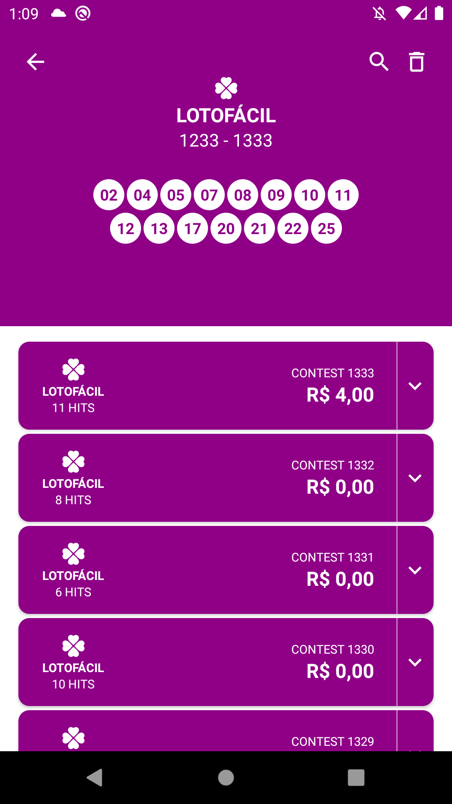
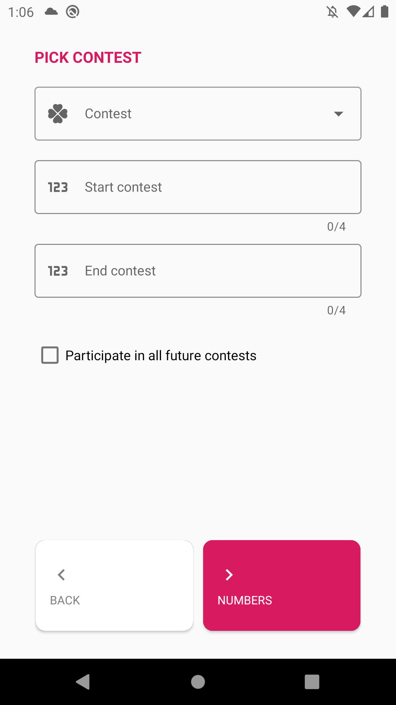
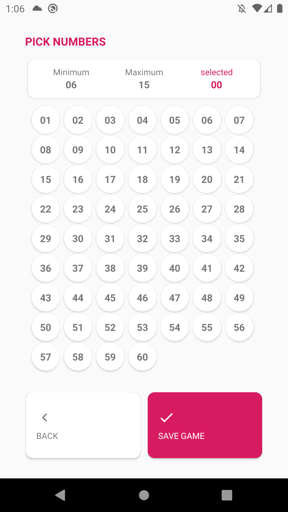

## Lottery

[Available on Google Play](https://play.google.com/store/apps/details?id=com.tiagoalmeida.lottery)

A simple lottery app which you can check your games with the results to see if you won some cash. 

<b>A lottery from Brazil</b>.

Some of the features are:

- It shows the latest results in a simple list
- It shows the user registered games in a list with GridLayoutManager with 2 columns.
- The games are saved in SharedPreferences.
- It has a filter in the user games.
- It's not necessary to have a register to use the app.
- It shows how much money you got in each contest.

> ### Attention

- If you want to download and run, you should get your API key at [Lottery API](https://apiloterias.com.br/) and add it in a .cpp file. You can create your own file or if you wish, you can download an empty .cpp file example here: [Google Drive Link](https://drive.google.com/file/d/1vezHNlQqV6vgWik0_DBbU9n3Zhzp9Iwe/view?usp=sharing)

> ### Current screens:

     
